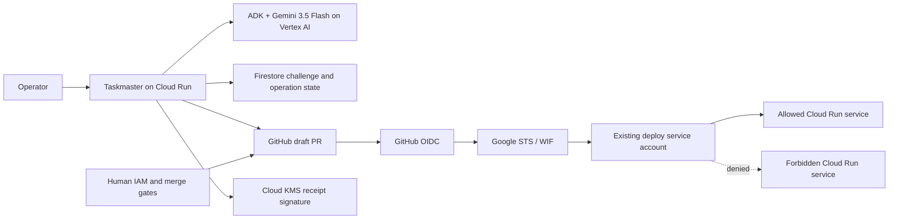

# Keyless Cutover

Keyless Cutover is a Taskmaster-track hackathon project for one risky security transaction: replace one long-lived Google service-account key used by one GitHub Actions deployment with narrowly bound Workload Identity Federation (WIF), prove both deployment continuity and hostile-identity denial, require humans at the IAM, merge, and key-disable boundaries, and produce a reconstructable receipt.

## The problem

Security teams know permanent cloud keys should be retired, but a bad migration can break deployments or trust the wrong repository. Existing scanners find replaceable secrets and official guides explain WIF; neither completes and proves the full cutover.

The target user is a platform-security or cloud-IAM engineer at a GCP-heavy software company. The job is:

> Close one key-retirement ticket with evidence that the intended deployment still works, trust did not widen, tested hostile identities failed, and the exact legacy key was disabled by a human.

Keyless is for proactive credential retirement, not emergency incident response.

## Exact v1 scope

- One public `github.com` repository, protected `main`, protected `production` environment, and canonical deployment workflow.
- One repository-scoped JSON secret containing one disposable user-managed GCP key.
- One narrowly scoped deployment service account.
- One allowed and one forbidden Cloud Run service.
- One ADK Taskmaster using `gemini-3.5-flash` through Vertex AI for sourced evidence interpretation and bounded failure diagnosis.
- Deterministic code owns CEL, IAM/resource identifiers, workflow patch bytes, policy decisions, hostile-test verdicts, and receipt completeness.
- Humans apply the reviewed WIF/IAM bundle, merge the PR, and disable the exact key.

## Before and after

```text
Before: GitHub secret → long-lived private key → deploy service account → Cloud Run
After:  GitHub OIDC → Google STS/WIF → same deploy service account → Cloud Run
```

Preserving the service account avoids changing downstream resource roles during the authentication cutover. It does not prove that the existing service account was already least-privileged.

## Minimal Google-native architecture



Firestore exists for one-time ProofV2 challenge consumption and evidence-derived operation state. KMS is added only after the real 48-hour transaction passes. Cloud Tasks, Pub/Sub, Agent Engine, Registry, Memory Bank, autonomous IAM mutation, and a multi-agent fleet are intentionally outside the hackathon build.

## Safety contract

- Keyless never receives or stores the private-key value, GitHub OIDC token, Google access token, or authorization header.
- Gemini never chooses authoritative repository, project, service account, key, provider, role, or target identifiers.
- A model output can never produce `PASS`, authorize IAM, merge a PR, disable a key, or complete a receipt.
- A human applies IAM, another protected review gates the workflow, and a human disables the key.
- A failed, missing, timed-out, or unexecuted hostile test is not a denial.
- KMS proves receipt origin and tamper resistance, not that external events happened.
- Disabling a key blocks fresh authentication but does not revoke access tokens minted earlier.

## Current status — August 13, 2026

Implemented locally:

- Git repository initialized.
- Node ProofV2 protocol primitives for random challenge issuance without a preselected key ID, separately expected authoritative context, a five-minute maximum window, active user-managed Google-key validation, bounded certificate lookup, and atomic-consumer replay rejection.
- Deterministic K0 v2 evidence-manifest verifier with fixed H1–H8 controls, typed/hashed GitHub and GCP evidence, unchanged-target requirements, cross-reference integrity, and false-safe rejection.
- Twenty-eight passing local tests, including a simultaneous replay race, the Cloud Run canary contract, exact cutover compilation, immutable WIF trust planning, strict ADK invocation/output/citation contracts, three-repeat deterministic evaluation thresholds, Firestore transitions, GitHub observation, authenticated Google key lookup, crash-window-aware draft PR creation, and offline evidence reconstruction.
- A locally built and exercised digest-pinned canary container.
- One canonical legacy deployment workflow, a non-running WIF cutover template preserving the same workflow path, and the H4 wrong-workflow probe; all actions are SHA-pinned and `actionlint` passes.
- The WIF template now executes H3 (fixed hostile branch), H5 (manual event), H6 (staging environment), H7 (wrong audience), and H8 (valid identity mutating the forbidden service) as explicit expected-denial jobs. A frozen external-repository template drives H1/H2; H4 remains the wrong-path workflow. Each expected denial emits a small credential-free artifact with platform run identity and actual step outcome; every workflow passes `actionlint` locally.
- A deterministic plan/apply compiler that refuses source drift, template drift, unpinned actions, credential retention, or workflow-path changes and emits byte-identical reviewed WIF workflow content.
- A deterministic WIF compiler that binds numeric owner/repository IDs, protected `main`, the canonical workflow, `push`, `production`, GitHub-hosted runners, provider URL audience, one impersonated service account, and only `roles/iam.workloadIdentityUser`.
- Two tool-free ADK `LlmAgent` stages pinned to `gemini-3.5-flash`: bounded evidence classification and allowlisted failure diagnosis. Their Zod schemas reject extra fields, and deterministic post-validation requires every cited evidence ID to exist in the supplied redacted bundle.
- A 36-case corpus (12 visible development, 12 sealed supported, 4 sealed refusal, 8 sealed recovery), a frozen rules-only baseline, and a raw-count evaluator that rejects forbidden model content.
- A sequential sealed-evaluation runner that performs exactly three isolated attempts for each of 24 sealed cases, emits only structured outputs or a fixed rejection code, and requires at least 70/72 schema-valid calls plus the documented case-majority gates.
- A Firestore challenge store with create-once issuance, transactional `ISSUED → CONSUMED` transition, expiry enforcement, and digest binding; an authoritative GitHub observer that rebuilds the proof context from a completed run, workflow blob, and independent environment review; and an ADC-backed exact Google key reader.
- A bearer-protected, bounded Node HTTP service that runs the two tool-free ADK stages, revalidates every final output, disables OpenTelemetry export in its pinned container, and has a locally built/started health check. No live Gemini inference has run.
- A canonical evidence-artifact format and semantic verifier: every K0 ledger digest must resolve to matching credential-free `artifacts/E###.json` bytes, and their contents must agree with the claimed key, WIF hashes, hostile identity/run/control, unchanged revision, human disable, legacy denial, and `wif-2` result.
- A selected-repository GitHub adapter that rechecks numeric owner/repository IDs, protected base SHA, live workflow bytes, and approved plan before creating compiler-owned branch bytes and a draft PR. It never merges and safely reuses only exact branch/PR residue after a retry.
- Google Cloud CLI installed.

Not yet proven:

- A live Firestore transaction and live GitHub/Google adapter calls; their interfaces and failure behavior are currently covered only by deterministic test doubles.
- GCP account, billing project, live WIF, deployed Cloud Run canaries, eight denials, human key disable, live Gemini calls, ADK deployment, KMS receipt, hosted console, or video.

The project remains **REVISE / NO-GO** until the 48-hour K0 test passes. No live security outcome is claimed from the local unit tests.

## 48-hour kill gate

K0 must produce real `legacy-1`, `wif-1`, and post-disable `wif-2` Cloud Run revisions; consume ProofV2 once; deny H1–H8 at their intended controls; keep the forbidden service unchanged; observe the exact key disabled by a human; reject a fresh online legacy authentication attempt; and produce a reconstructable, credential-free manifest.

Any mocked core evidence, replay acceptance, hostile success, secret leak, wrong-key ambiguity, hand-repaired generated patch, or failed post-disable WIF deployment kills or pivots the project.

## Documentation

- [Master plan](docs/MASTER_PLAN.md)
- [Development chunks](docs/DEVELOPMENT_PLAN.md)
- [Ten-agent debate](docs/RESEARCH_DEBATE.md)
- [Architecture](docs/ARCHITECTURE.md)
- [Security model](docs/SECURITY_MODEL.md)
- [Support and hostile-test matrix](docs/SUPPORT_MATRIX.md)
- [Evaluation gates](docs/EVALUATION.md)
- [Four-minute demo](docs/DEMO_RUNBOOK.md)
- [Official source index](docs/SOURCES.md)
- [ADR 0002: Taskmaster scope](docs/adr/0002-TASKMASTER_SCOPE.md)

## Development

```sh
npm ci --legacy-peer-deps
npm test
npm audit --omit=dev --audit-level=high
npm run run:eval -- predictions.json
npm run score:eval -- predictions.json
```

Node 22 or newer is required. Live setup instructions will be added only after K0 is reproducible.

## Track and judging position

- Track: **The Taskmaster — Build a Complete Workflow, Not Just a Chatbot**.
- Current judge-style estimate: Stage One fail; counterfactual 52/100.
- Projected only after every gate: approximately 90/100 under the official 40/30/30 weighting.

These are internal estimates, not organizer scores or a guarantee of winning.
