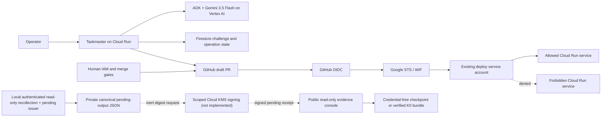

# Keyless Cutover

**The key is gone. The deployment continued without it.** Twice, on real GitHub and real Google Cloud, with eight hostile identities denied at their intended controls and every step reconstructable from public run IDs and audit entries.

Keyless Cutover is a Taskmaster-track project for one risky security transaction: replace a long-lived Google service-account key used by a GitHub Actions deployment with narrowly bound Workload Identity Federation, prove deployment continuity and hostile-identity denial, require humans at the IAM, merge, and key-disable boundaries, and produce a reconstructable receipt.

## Judge quick start

No credentials, no build, under a minute:

1. **Open the live evidence console:** <https://keyless-evidence-208865688014.us-central1.run.app> — every gate links to a real GitHub run or Google audit entry.
2. **See the attack matrix:** [eight hostile attempts, all denied](https://github.com/trustphoneapp/keyless-cutover/actions/runs/32889506466).
3. **See the keyless deploy:** [run 32892682978](https://github.com/trustphoneapp/keyless-cutover/actions/runs/32892682978), seven minutes after the key was disabled.

To validate locally (Node >= 22): `npm ci --legacy-peer-deps --ignore-scripts && npm test`. Full instructions in [Development](#development).

## The problem

In 2025 alone, 28.65 million new hardcoded secrets landed in public GitHub commits, and 64% of the credentials found valid in 2022 were still live and exploitable four years later. One leaked vendor API key reached over 3,000 US Treasury files. A key left in a repo cost Uber 57 million user records and its security chief a federal conviction. Two-thirds of the Forbes AI 50 have leaked verified secrets.

The pattern never changes: a credential exists as a copyable thing, and durability is the vulnerability. Rotation, scanners, and vaults manage that risk. None of them remove it.

Security teams know permanent cloud keys should be retired, but a bad migration can break deployments or trust the wrong repository. Existing scanners find replaceable secrets and official guides explain WIF; neither completes and proves the full cutover.

The target user is a platform-security or cloud-IAM engineer at a GCP-heavy software company. The job is:

> Close one key-retirement ticket with evidence that the intended deployment still works, trust did not widen, tested hostile identities failed, and the exact legacy key was disabled by a human.

Keyless is for proactive credential retirement, not emergency incident response.

## Exact v1 scope

- One public `github.com` repository, protected `main`, protected `production` environment, and canonical deployment workflow.
- One repository-scoped JSON secret containing one disposable user-managed GCP key.
- One narrowly scoped deployment service account.
- One allowed and one forbidden Cloud Run service.
- One ADK Taskmaster using `gemini-3.5-flash` through Vertex AI for sourced evidence interpretation and bounded failure diagnosis.
- Deterministic code owns CEL, IAM/resource identifiers, workflow patch bytes, policy decisions, hostile-test verdicts, and receipt completeness.
- Humans apply the reviewed WIF/IAM bundle, merge the PR, and disable the exact key.

## Before and after

```text
Before: GitHub secret → long-lived private key → deploy service account → Cloud Run
After:  GitHub OIDC → Google STS/WIF → same deploy service account → Cloud Run
```

Preserving the service account avoids changing downstream resource roles during the authentication cutover. It does not prove that the existing service account was already least-privileged.

## Minimal Google-native architecture



Firestore exists for one-time ProofV2 challenge consumption and evidence-derived operation state. The published RC implements and tests authenticated read-only recollection and pending issuance, but it has not been run against an eligible live 48-hour transaction. The live KMS key/signing call remains gated. Cloud Tasks, Pub/Sub, Agent Engine, Registry, Memory Bank, autonomous IAM mutation, and a multi-agent fleet are intentionally outside the hackathon build.

## Safety contract

- Keyless never receives the private-key value and never persists or sends GitHub OIDC tokens, Google access tokens, or HTTP authorization headers to Gemini. The private Cloud Run service uses Google IAM for caller identity plus a separate `X-Keyless-API-Token` application gate; neither credential is logged or model-bound.
- Gemini never chooses authoritative repository, project, service account, key, provider, role, or target identifiers.
- A model output can never produce `PASS`, authorize IAM, merge a PR, disable a key, or complete a receipt.
- A human applies IAM, another protected review gates the workflow, and a human disables the key.
- A failed, missing, timed-out, or unexecuted hostile test is not a denial.
- KMS proves receipt origin and tamper resistance, not that external events happened.
- Disabling a key blocks fresh authentication but does not revoke access tokens minted earlier.

## Current status — August 24, 2026

Implemented locally:

- Git repository initialized.
- Node ProofV2 protocol primitives for random challenge issuance without a preselected key ID, separately expected authoritative context, a five-minute maximum window, active user-managed Google-key validation, bounded certificate lookup, and atomic-consumer replay rejection.
- Deterministic K0 v3 evidence-manifest and semantic verification with exact canonical manifest/artifact bytes, fixed H1–H8 controls, authoritative GitHub/GCP scope binding, unchanged-target requirements, cross-reference integrity, and false-safe rejection.
- A passing local suite covering replay races, Cloud Run and console contracts, documentation links, exact cutover compilation, Firestore transitions, authoritative GitHub/GCP collectors, ProofV2, pre-disable and disable reconstruction, offline bundle/receipt verification, FIFO rejection, and deterministic tamper failures without relying on a brittle published test count.
- A locally built and exercised digest-pinned canary container.
- One canonical legacy deployment workflow, a non-running WIF cutover template preserving the same workflow path, and the H4 wrong-workflow probe; all actions are SHA-pinned and `actionlint` passes.
- The WIF template now executes H3 (fixed hostile branch), H5 (manual event), H6 (staging environment), H7 (wrong audience), and H8 (valid identity mutating the forbidden service) as explicit expected-denial jobs. A frozen external-repository template drives H1/H2; H4 remains the wrong-path workflow. Each expected denial emits a small credential-free artifact with platform run identity and actual step outcome; every workflow passes `actionlint` locally.
- A deterministic plan/apply compiler that refuses source drift, template drift, unpinned actions, credential retention, or workflow-path changes and emits byte-identical reviewed WIF workflow content.
- A deterministic WIF compiler that binds numeric owner/repository IDs, protected `main`, the canonical workflow, `push`, `production`, GitHub-hosted runners, provider URL audience, one impersonated service account, and only `roles/iam.workloadIdentityUser`.
- Two tool-free ADK `LlmAgent` stages pinned to `gemini-3.5-flash`: bounded evidence classification and allowlisted failure diagnosis. Their Zod schemas reject extra fields, and deterministic post-validation requires every cited evidence ID to exist in the supplied redacted bundle.
- A 36-case corpus (12 visible development, 12 sealed supported, 4 sealed refusal, 8 sealed recovery), a frozen rules-only baseline, and a raw-count evaluator that rejects forbidden model content.
- A sequential sealed-evaluation runner that performs exactly three isolated attempts for each of 24 sealed cases, emits only structured outputs or a fixed rejection code, and requires at least 70/72 schema-valid calls plus the documented case-majority gates.
- A second Google model, Gemma 4 26B A4B via the Vertex AI managed endpoint, integrated as a sealed-evaluation baseline (`src/run-eval-baseline.mjs`): same corpus, same instructions, same validators, no API key. It scored 6/12 supported cases, 0/4 safe refusals, 1/8 recoveries, and 57/72 schema-valid calls against Gemini 3.5 Flash's 12/12, 4/4, 8/8, and 72/72 — the zero safe refusals alone disqualify it from the transaction path, which is exactly what the Gemini-necessity gate exists to test ([`docs/evidence/GEMMA4_BASELINE_EVAL_2026-08-30.json`](docs/evidence/GEMMA4_BASELINE_EVAL_2026-08-30.json)).
- A Firestore challenge store with create-once issuance, transactional `ISSUED → CONSUMED` transition, expiry enforcement, and digest binding; an authoritative GitHub observer that rebuilds the proof context from a completed run, workflow blob, and independent environment review; and an ADC-backed exact Google key reader.
- A fail-closed ProofV2 operator with separate `issue` and `verify` commands. It emits only the five bounded dispatch inputs, accepts GitHub credentials only through an environment variable, refetches the exact run/workflow/artifact/reviewer, validates the active Google key and certificate, atomically consumes once, rejects replay, and reconstructs the exact receipt after a crash that occurs immediately after consumption.
- A private, bounded Node HTTP service that runs the two tool-free ADK stages, revalidates every final output, and disables OpenTelemetry export in its pinned container. Cloud Run IAM authenticates an invoke-only operator and a separate `X-Keyless-API-Token` gates the model routes. A real served Vertex Gemini 3.5 Flash request passed both gates; IAM alone reached the app and was rejected with 401.
- A dependency-free, read-only evidence console that renders only a validated credential-free checkpoint or a fully verified external K0 bundle. It has no client script or mutation route, rejects forged or mutated status objects through a private authoritative snapshot, rejects FIFO/non-regular inputs without blocking, and never exposes a local release-ready state.
- A canonical evidence-artifact format and semantic verifier: every K0 ledger digest resolves to matching credential-free `artifacts/E###.json` bytes captured once, and their contents agree with the claimed key, reviewed workflows/runs, WIF audit provenance, Cloud Run readback, hostile identity/run/control, unchanged revision, human disable, legacy denial, and `wif-2` result.
- A dependency-free offline assembler plus shared exact filesystem loader. `assemble` validates fully before creating a new directory and never overwrites; `verify` requires canonical `manifest.json`, exact `artifacts/E###.json` enumeration, bounded regular files, and no network or cloud access.
- A deterministic canonical pending receipt derived from the exact verified manifest bytes, with `K0_VERIFIED_RECEIPT_PENDING`, `RECOLLECTION_REQUIRED`, and `release_ready: false`. A local authenticated issuer now recollects the fixed GitHub/GCP sources through read-only credentials, verifies the complete v3 transaction, and writes one canonical private JSON basename in its current working directory. The issuer creates and re-verifies the pending envelope and its inert KMS digest request; it does not verify a returned signature and has no signer, KMS client, or promotion fallback.
- A separate public verification primitive validates a canonical signature sidecar against the exact pending-receipt bytes, approved algorithm, full pinned KMS key version, and out-of-band pinned public key. Even a valid signature cannot promote authorization or release readiness.
- A 36/36 deterministic mutation matrix spanning bundle, artifact, receipt, signature, and trust-anchor changes, including one-byte, noncanonical-byte, wrong-key, and valid-second-key substitution failures.
- A selected-repository GitHub adapter that rechecks numeric owner/repository IDs, protected base SHA, live workflow bytes, and approved plan before creating compiler-owned branch bytes and a draft PR. It never merges and safely reuses only exact branch/PR residue after a retry.
- Authoritative GitHub collectors that refetch independently reviewed workflow approvals, exact workflow/release-marker bytes at the pinned commit, completed deploy runs/jobs/steps/environment review, and hostile/legacy probe evidence. Generic setup/network failures and caller-supplied run claims remain unproven.
- ADC-backed Google collectors that hash the exact live provider configuration, require the approved repository impersonation binding as the only service-account IAM delta, project bounded official STS/IAM Credentials audit shapes, reject pagination/ambiguity, and read authoritative Cloud Run revision/create-time/release-marker/image-digest state without copying GitHub identity into cloud evidence.
- A protected manual legacy-auth workflow and collector that remain available after the canonical workflow becomes WIF, force a fresh Google request with the exact old key on a new hosted runner, and accept only a Google key/authentication rejection signature. The workflow cannot deploy.
- A bounded Cloud Logging query that accepts exactly one successful `DisableServiceAccountKey` Admin Activity entry for the scoped key, expected human principal, and approved 24-hour-or-shorter window; ambiguity blocks final evidence.
- A `k0-predisable-collect` executable over those collectors, split into two commands so the forbidden-target read can happen in time: `observe-forbidden` records the forbidden revision before the first hostile probe starts, and `collect` assembles the bundle input, archive plan, and checkpoint receipt from the exact live sources. Nothing in it mutates GitHub or Google state.
- The WIF audit normalizer accepts the shape Cloud Audit Logs actually return—`principalEmail` alongside `principalSubject`, plus token lifetime and issuer fields—and anchors its lookup window to the deploy job rather than the run's `started_at`, which precedes the exchange. The exact `{@type, grantType}` STS request assertions are deliberate and sourced from Google's published audit examples; they are not an oversight to relax.
- Google Cloud CLI installed.

## The fresh transaction — August 24, 2026

A fresh disposable key completed the pre-disable half of v3, sealed a correctly-ordered archive checkpoint, was disabled by a human, and was proven unable to authenticate afterward. Continuity (`wif-2`) could not be completed, for a structural reason discovered live, not for lack of time. Both are recorded honestly below rather than folded into a single pass/fail line.

**Completed and sealed, all against real GitHub and Google state, no mocks:**

- Fresh disposable key `1f0137c50d534e23c58e2ae0f84ccf3a9847351d`, created 2026-08-14, authenticated a fresh legacy baseline through the repository-scoped JSON key and deployed `keyless-demo-legacy-3` at `2026-08-24T18:17:43Z`.
- ProofV2 run [32761994628](https://github.com/trustphoneapp/keyless-cutover/actions/runs/32761994628) issued its challenge at `18:21:53.605Z`, consumed it at `18:23:16.936Z`, 217 seconds before the 5-minute expiry, rejected replay, and survived reconstruction after consumption.
- The compiler-owned WIF cutover ([PR #28](https://github.com/trustphoneapp/keyless-cutover/pull/28)) merged at `18:29:12Z`; `keyless-demo-wif-3` deployed through Workload Identity Federation at `18:43:05Z`, no key involved.
- All eight hostile identities reached their intended control and were denied: H1 from the foreign-owner repository `cherala2002/keyless-h1-probe`, H2 from the wrong-repository fixture, H3 (wrong ref), H4 (wrong workflow), H5 (wrong event), H6 (wrong environment), H7 (wrong audience), and H8, which authenticated with a valid identity and was denied specifically at Cloud Run IAM. `keyless-forbidden-00001-rvf` was observed unchanged both before the first probe and after the last one.
- The canonical pre-disable archive — [`docs/evidence/K0_PREDISABLE_ARCHIVE_2026-08-24.json`](docs/evidence/K0_PREDISABLE_ARCHIVE_2026-08-24.json), 37 evidence entries, `sealed_at: 2026-08-24T19:59:09Z` — was reviewed and merged ([PR #35](https://github.com/trustphoneapp/keyless-cutover/pull/35)) at `20:03:34Z`. Its required `test` check completed at `20:04:29Z` and its main push run at `20:04:30Z`, **both before** the disable that follows. This is the exact ordering the historical August transaction failed to satisfy.
- The human key operator disabled the exact key at `2026-08-24T20:05:49Z`; Admin Activity records principal `yashwanth.surabhi@gmail.com`, method `google.iam.admin.v1.DisableServiceAccountKey`, insert ID `1r9n1a8e78acr`.
- A fresh, online authentication attempt with the disabled key on a new hosted runner ([run 32771996082](https://github.com/trustphoneapp/keyless-cutover/actions/runs/32771996082)) reached Google and was rejected.

**Not completed, and why it cannot be, on this repository:**

Continuity requires a fresh `wif-2` deploy whose workflow bytes match `manifest.cutover.workflow_blob_sha` exactly, deployed inside an audit window containing precisely two Cloud Audit Log entries. Live testing found these two requirements now permanently in conflict:

- `deploy`, `h6-wrong-environment`, `h7-wrong-audience`, and `h8-forbidden-resource` share one trigger condition, so any push that deploys also runs the hostile probes in the same job batch. H6's rejected attempt still logs against the correct provider, and H8's is a *valid* identity — indistinguishable from `deploy`'s own exchange at the audit-log layer, since both are legitimate uses of the same identity within seconds of each other. `readWifAuditEvidenceObserved`'s query matches on provider and time window only; there is no field in a Cloud Audit Log entry that separates "the deploy's own exchange" from "H8's exchange of the same identity," so no narrower query could collect a clean artifact even in principle. The collector's `pageSize: 2` throws the moment the underlying query has more than two matches — before any evidence artifact is produced, so the manifest's ability to hold multiple `GCP_WIF_AUDIT_LOG` entries and search among them for a match (`k0-evidence-semantics.mjs`'s `matchedWifAudit`) never gets a candidate to search.
- The fix — gating the hostile jobs behind `vars.KEYLESS_K0_POST_DISABLE_PUSH` ([PR #37](https://github.com/trustphoneapp/keyless-cutover/pull/37)) — changes the workflow's bytes, which breaks the *other* required match: a post-disable run's blob SHA must equal the one pinned when `wif-1` first ran, before the gate existed.
- Restarting with a new key does not route around the audit-window collision above, though the analysis at the time was wrong about a separate point: it claimed a fresh `legacy_baseline` could never be collected again after the one-time cutover merged. It can — the workflow file can be reverted to the legacy template, a fresh baseline collected, and cut back over to WIF, which is exactly what the second transaction below does. That earlier claim is corrected here rather than left standing.

No live security outcome is claimed beyond what is listed above. Authenticated pending issuance, the scoped KMS signature, and the separate human release decision remain gated behind `RECOLLECTION_REQUIRED` and `release_ready: false`, as designed — this transaction does not attempt them, since `post_disable` evidence cannot exist to feed them.

Archive-before-disable ordering, the property this project exists to prove, was satisfied for the first time on real infrastructure in this transaction. The second transaction below repeats it and carries the work further.

## The second transaction — August 25, 2026

A second, independent fresh disposable-key transaction repeated the entire sequence end to end, deliberately testing the fix for the August 24 finding. The fix worked exactly as predicted. Continuity still did not complete, for a second, deeper, and more permanent structural reason found live during this transaction.

**Completed and sealed, all against real GitHub and Google state, no mocks:**

- Fresh disposable key `851d450387816d7d48ab9b07534277c2606acf78` authenticated a fresh legacy baseline and deployed `keyless-demo-legacy-4` at `2026-08-25T19:16:49Z`.
- ProofV2 run [32888780262](https://github.com/trustphoneapp/keyless-cutover/actions/runs/32888780262) issued its challenge at `19:17:46.003Z`, consumed it at `19:19:10.625Z`, rejected replay, and bound the exact key ID with `environment_review` independently confirming the reviewer differed from the actor.
- The compiler-owned WIF cutover ([PR #44](https://github.com/trustphoneapp/keyless-cutover/pull/44)) merged at `19:23:27Z`, copying `k0/templates/k0-deploy.wif.yml` — which already carried the [PR #37](https://github.com/trustphoneapp/keyless-cutover/pull/37) post-disable-push gate — so this transaction's own `wif-1` pinned bytes included that gate from its very first deploy, unlike August 24's transaction, whose `wif-1` predated the gate.
- `keyless-demo-wif-5` deployed through WIF at `19:33:08Z`. All eight hostile identities reached their intended control and were denied: H1 ([run 32888131861](https://github.com/cherala2002/keyless-h1-probe/actions/runs/32888131861), foreign owner), H2 ([run 32888234007](https://github.com/trustphoneapp/keyless-hostile/actions/runs/32888234007), wrong repository), H3 (wrong ref — an initial dispatch used a stale local branch state and produced bytes that didn't match the merged workflow; caught before use, corrected, and rerun as [run 32891258388](https://github.com/trustphoneapp/keyless-cutover/actions/runs/32891258388)), H4 (wrong workflow), H5 (wrong event), H6 (wrong environment), H7 (wrong audience), and H8 (valid identity, denied at Cloud Run IAM). `keyless-forbidden-00001-rvf` observed unchanged throughout.
- The canonical pre-disable archive — [`docs/evidence/K0_PREDISABLE_ARCHIVE_2026-08-25.json`](docs/evidence/K0_PREDISABLE_ARCHIVE_2026-08-25.json), 37 evidence entries, `sealed_at: 2026-08-25T19:47:04Z` — was reviewed and merged ([PR #46](https://github.com/trustphoneapp/keyless-cutover/pull/46)) at `19:52:39Z`. Its required `test` check completed at `19:49:06Z` and its main push run at `19:53:45Z`, **both before** the disable that follows — the correct ordering, proven a second time.
- The human key operator disabled the exact key at `2026-08-25T19:54:19.767Z`; Admin Activity records principal `yashwanth.surabhi@gmail.com`, method `google.iam.admin.v1.DisableServiceAccountKey`, insert ID `121ieyedb54y`.
- A fresh, online authentication attempt with the disabled key on a new hosted runner ([run 32892290171](https://github.com/trustphoneapp/keyless-cutover/actions/runs/32892290171)) reached Google and was rejected.
- With `KEYLESS_K0_POST_DISABLE_PUSH=true` armed, the post-disable push ([PR #47](https://github.com/trustphoneapp/keyless-cutover/pull/47), merged `19:59:01Z`) deployed `keyless-demo-wif-6` at `20:01:25.304Z` — **live, through WIF, with no key anywhere in the picture, after the key was already disabled.** h6-wrong-environment, h7-wrong-audience, and h8-forbidden-resource all showed `skipped` before `deploy` was even approved, exactly as the gate was designed to do. H4, whose trigger the gate does not cover, was deliberately left unapproved and never ran.

**Still not completed, for a different and more permanent reason than August 24:**

The August 24 finding — hostile jobs sharing `deploy`'s trigger and polluting the audit window — is fixed and confirmed working live. But isolating the audit window to just the `deploy` job's own start-to-revision-create-time span, with every hostile job either skipped or left unapproved, still produced **three** Cloud Audit Log entries, not the two `readWifAuditEvidenceObserved` requires:

- `google-github-actions/auth` performs its own Security Token Service exchange when it creates its credentials file (`20:01:15.926Z`).
- `gcloud run deploy`, handed an `external_account` credential file rather than a cached token, performs its own independent exchange and impersonation when it actually calls the Cloud Run API (`20:01:23.814Z` and `20:01:23.927Z`).

This is not hostile interference; it is how this authentication action and `gcloud` combine on every deploy, clean or not. `projectWifAuditEvidence`'s requirement of exactly two entries was built on a premise — one exchange per deploy — that this tool combination never actually satisfies. Gating the hostile jobs was necessary, proven correct, and not sufficient. A real fix would mean changing how the evidence collector distinguishes an authentication action's own setup exchange from the deploying tool's real one, or restructuring the deploy step to avoid the double exchange entirely — a change to fail-closed evidence logic, not a retry.

No live security outcome is claimed beyond what is listed above. Authenticated pending issuance, the scoped KMS signature, and the separate human release decision remain gated behind `RECOLLECTION_REQUIRED` and `release_ready: false`, as designed — this transaction does not attempt them, since `post_disable` evidence cannot exist to feed them. A Cloud KMS keyring, asymmetric signing key, and narrowly scoped `keyless-receipt-sa` service account were provisioned during this transaction and remain available for a future attempt.

**What two live transactions established:** archive-before-disable ordering, proven twice independently on real infrastructure; eight hostile identities denied at their intended controls, twice; a human disabling the exact key and that key then being refused by Google on a fresh online attempt; and a deployment that continued through Workload Identity Federation with no key anywhere in the picture.

**What the corrected checks add:** the audit assertions were originally pinned to Google's published example shapes. Recording this project's own live exchanges showed the real logs differ, and the checks are now pinned to observed reality with every relaxed shape paid for by a stronger value binding — `audience` bound to the verified provider, the token grant bound to the expected service account, the IdP subject built from validated numeric IDs. All 10 genuine historical exchanges now parse where none could before, and 10 forgery attempts are still refused. Certifying the post-disable deployment end to end is one transaction away on those corrected checks.

## 48-hour kill gate

The fresh K0 order is fixed: collect a fresh legacy baseline, ProofV2, WIF-1 parity, and H1–H8 including H2; review and merge the canonical pre-disable archive checkpoint while the fresh key remains enabled; have a human disable the exact key and read it back; prove fresh legacy denial before deploying and reading back `wif-2`; run authenticated pending issuance; separately authorize and verify the scoped KMS signature; then leave release to a separate human decision. The signature does not replace that boundary, and local v3 reconstruction alone does not pass this gate.

The verifier selects the earliest authoritative occurrence time, checkpoint-receipt `recorded_at`, or checkpoint event time across the final evidence and requires `manifest.assembled_at`—the latest authenticated final collection—to be no more than 48 hours later. Archive or checkpoint sealing and later recollection cannot reset, backdate, or extend that window.

In practice the window opens at the first approval pull-request review, not at the first workflow run: `occurrenceValues` in `src/k0-evidence-semantics.mjs` treats both `reviewed_at` and `merged_at` of every `GITHUB_PULL_REQUEST` artifact as authoritative occurrences, and the manifest carries five approval-workflow PRs plus the cutover and archive-checkpoint PRs. Reviewing any one of them early spends the window before a single deploy runs.

Any mocked core evidence, replay acceptance, hostile success, secret leak, wrong-key ambiguity, hand-repaired generated patch, or failed post-disable WIF deployment kills or pivots the project.

## Documentation

- [Master plan](docs/MASTER_PLAN.md)
- [Development chunks](docs/DEVELOPMENT_PLAN.md)
- [Ten-agent debate](docs/RESEARCH_DEBATE.md)
- [Architecture](docs/ARCHITECTURE.md)
- [Security model](docs/SECURITY_MODEL.md)
- [Support and hostile-test matrix](docs/SUPPORT_MATRIX.md)
- [Evaluation gates](docs/EVALUATION.md)
- [Independent reviewer and K0 operator runbook](docs/REVIEWER_RUNBOOK.md)
- [Protection read-back, 2026-08-15](docs/evidence/REPOSITORY_PROTECTION_2026-08-15.md)
- [Four-minute demo](docs/DEMO_RUNBOOK.md)
- [Devpost submission draft](docs/SUBMISSION_DRAFT.md)
- [Release and submission checklist](docs/SUBMISSION_CHECKLIST.md)
- [Official source index](docs/SOURCES.md)
- [ADR 0002: Taskmaster scope](docs/adr/0002-TASKMASTER_SCOPE.md)

### Scope, claims, and boundaries

- [Claims and limitations](docs/CLAIMS_AND_LIMITATIONS.md) — what may and may not be said publicly, and the forbidden marketing wording.
- [Threat model](docs/THREAT_MODEL.md)
- [Model boundary](docs/MODEL_BOUNDARY.md) — what Gemini may and may not decide.
- [Permissions](docs/PERMISSIONS.md)
- [Data handling](docs/DATA_HANDLING.md)

### Operating the system

- [Developer quickstart](docs/QUICKSTART.md)
- [Operations and failure recovery](docs/OPERATIONS.md)
- [Approvals and rollback](docs/APPROVALS_AND_ROLLBACK.md)
- [State machine](docs/STATE_MACHINE.md)
- [Receipts](docs/RECEIPTS.md)
- [Internal API surface](docs/API.md)

## Development

```sh
npm run preflight   # = npm ci + npm audit + actionlint + npm test

# or step by step:
npm ci --legacy-peer-deps --ignore-scripts
npm test
npm audit --omit=dev --audit-level=high
npm run run:eval -- predictions.json
npm run score:eval -- predictions.json
```

Node 22 or newer is required. Live setup instructions will be added only after K0 is reproducible.

## Track and judging position

- Track: **The Taskmaster — Build a Complete Workflow, Not Just a Chatbot**.
- The mandatory served Google/ADK path now exists.
- Any final judging or submission claim still waits on the incomplete K0, scoped live receipt signature, updated hosted console, and video gates.

Historical planning estimates are recorded in the research debate; they are not current organizer scores or a guarantee of winning.
