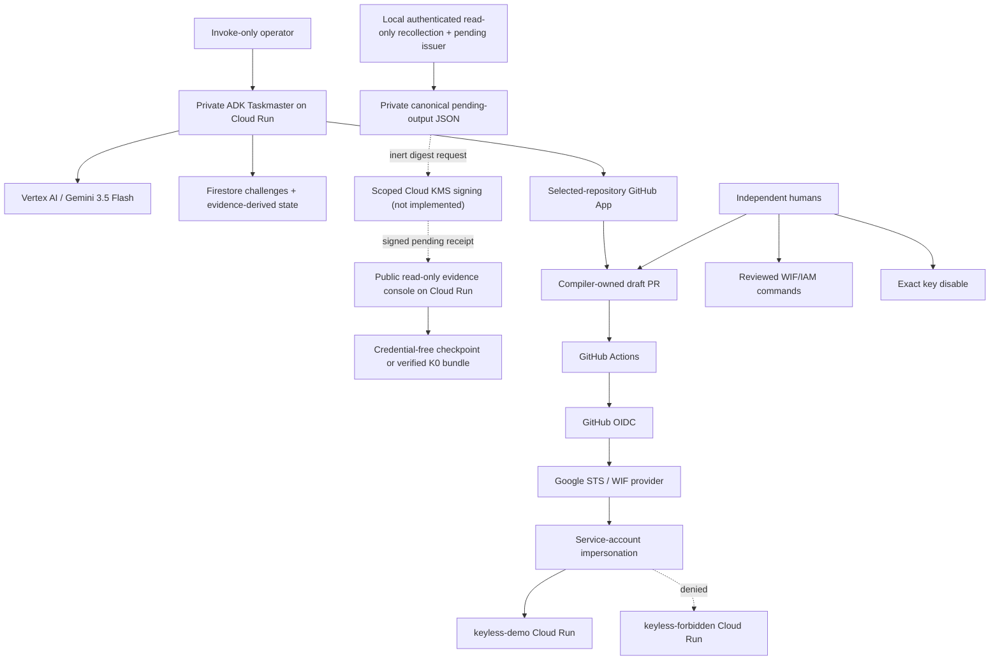

# Architecture

## Status

This is the accepted Taskmaster architecture. The implementation includes ProofV2 adapters, deterministic compilers, two tool-free ADK stages, a private dual-authenticated Cloud Run agent, a public read-only evidence console, and a published authenticated read-only pending issuer. The recorded WIF cutover, H1–H8 matrix, and key disable are historical readiness only because no canonical v3 pre-disable archive checkpoint was reviewed and merged before disable. Never re-enable that key to resume the transaction. No separately authorized fresh disposable transaction or authenticated live pending-issuer output is evidenced; scoped signing and human release remain later separate gates.

## Components



## Why each Google service exists

| Service | Necessary role | Judge-visible proof |
|---|---|---|
| Vertex AI / Gemini | Interpret variable workflow/script evidence and diagnose cross-system failures | Typed sourced result and ablation |
| Google ADK | Orchestrate evidence and recovery stages in the served path | ADK trace and Cloud Run request |
| Cloud Run | Isolate the private Taskmaster, public read-only console, and allowed/forbidden deployment targets | URLs, service IAM, and revision IDs |
| IAM / STS / WIF | Replace the permanent authentication path | Provider readback and real token exchange |
| Firestore | Issue and atomically consume ProofV2 challenges; persist evidence-derived state | One replay accepted, second rejected |
| Cloud KMS | Planned scoped signing of the canonical pending-receipt digest after authenticated live recollection | Real signature plus pinned out-of-band public verification; local pending issuer exists, but no live issuance/signature has run |
| Secret Manager | Store GitHub App credential after K0 | Access policy and audit reference, never value |

Cloud Tasks, Pub/Sub, Agent Engine, Registry, Memory Bank, Model Armor, Cloud Build, and automated IAM are not required for v1. The small public console is a separate service so making the demo URL public never removes Cloud Run IAM from the private model routes.

## Authentication flow

### Legacy

```text
repository secret
→ service-account JSON private key
→ OAuth access token
→ deployment service account
→ allowed Cloud Run service
```

### Federated

```text
GitHub-hosted deploy job
→ five-minute GitHub OIDC token
→ exact WIF issuer/audience/mapping/condition
→ roles/iam.workloadIdentityUser on one deploy service account
→ service-account impersonation
→ short-lived Google credential
→ same allowed Cloud Run service
```

The provider binds immutable numeric owner/repository IDs plus protected ref, exact workflow reference, allowed event, protected environment, GitHub-hosted runner, and canonical audience. The exact emitted claims must be observed in K0 rather than assumed.

## Control planes

### Model plane

Reads bounded, redacted evidence. Returns cited candidate semantics, missing facts, and fixed-enum recovery diagnoses. It has no mutation credentials.

### Deterministic plane

Validates schemas/spans/digests, authoritative scope, support/refusal rules, exact CEL/mappings, normalized permission diff, patch bytes, hostile-test oracles, state transitions, and receipt completeness.

The K0 v3 path uses authenticated GitHub approval/deploy collectors and bounded GCP provider, WIF-audit, key-disable, and Cloud Run readback collectors. Offline assembly writes canonical `manifest.json` plus exact `artifacts/E###.json`; the CLI and console share one bounded, nonblocking, no-follow filesystem loader that captures each byte sequence once, rejects missing/extra/noncanonical files, and performs no network access.

The local issuer accepts one strict credential-free recollection plan, uses a GitHub read token from `KEYLESS_GITHUB_TOKEN` plus read-only GCP ADC, and recollects the fixed authenticated sources. It requires the exact independently reviewed and merged checkpoint archive from a fresh transaction, created while that transaction's key was enabled. Across the final evidence, the verifier selects the earliest authoritative occurrence time, checkpoint-receipt `recorded_at`, or checkpoint event time and requires `manifest.assembled_at`—the latest authenticated final collection—to be no more than 48 hours later. Archive or checkpoint sealing and later recollection cannot reset, backdate, or extend that window. After full in-memory v3 verification the issuer writes one canonical mode-`0600` JSON basename relative to the process’s already-anchored current working directory; it never accepts an output parent path or overwrites an existing entry.

That output reconstructs only `K0_VERIFIED_RECEIPT_PENDING` with `RECOLLECTION_REQUIRED` and `release_ready: false`, plus an inert domain-separated KMS digest request. Public signature verification remains pinned out of band. There is no signer, KMS client, authenticated live run, or local promotion path.

### Human plane

Applies IAM, approves/merges the RC and archive-checkpoint PRs, disables the fresh exact key, separately authorizes scoped signing, and owns rollback and release. The historical key is never re-enabled. Keyless cannot perform these actions or promote release.

## Evidence-derived operation state

Use minimal phases:

```text
observe → key_proof → review → wif_validation
→ human_disable → post_disable → complete
```

Each phase is `running`, `ready_for_human`, `hold`, `failed_safe`, or `complete`. A UI cannot set state directly; it is derived from authoritative evidence. `not_run`, `pending`, timeout, and missing logs never satisfy a security gate.

The console has no mutation route and no client-side script. With no configured K0 bundle it renders the validated historical checkpoint as `NO_GO_INCOMPLETE` and explicitly identifies the missing pre-disable archive checkpoint; configured invalid or partial inputs become `NO_GO_VERIFICATION_FAILED` with no fallback. An exact external v3 bundle advances only to `K0_VERIFIED_RECEIPT_PENDING` and says that the local issuer exists but no authenticated live issuer output is evidenced. Its private authoritative status snapshot prevents forged objects, stateful accessors, or later mutation from changing served HTML/API, and FIFO/non-regular inputs fail without blocking. The signature verifier already exists, but even a valid pinned signature leaves authorization `RECOLLECTION_REQUIRED`; no local release-ready or final state is representable.

## External operation rule

For every read or permitted non-IAM write:

```text
record expected intent and preconditions
→ read authoritative external state
→ act only when allowed
→ read the resulting state
→ persist evidence identifiers
```

K0 is manual and sequential. No exactly-once, webhook, or crash-recovery guarantee is claimed.
