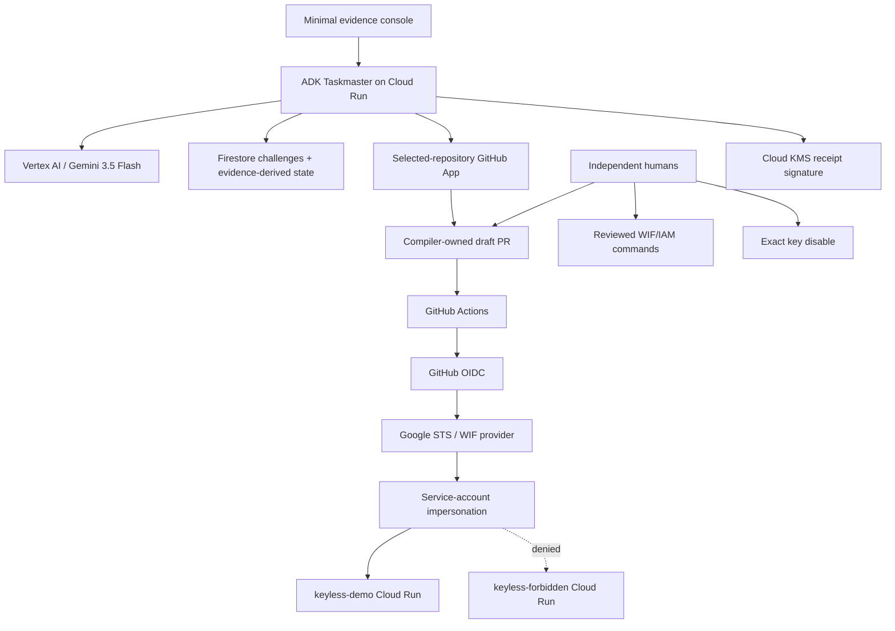

# Architecture

## Status

This is the accepted Taskmaster architecture. The local code now includes ProofV2 adapters, deterministic compilers, two tool-free ADK stages, and a bearer-protected agent container that passes a local health check. Cloud deployment and live external evidence remain planned until K0/K1 prove them.

## Components



## Why each Google service exists

| Service | Necessary role | Judge-visible proof |
|---|---|---|
| Vertex AI / Gemini | Interpret variable workflow/script evidence and diagnose cross-system failures | Typed sourced result and ablation |
| Google ADK | Orchestrate evidence and recovery stages in the served path | ADK trace and Cloud Run request |
| Cloud Run | Host Taskmaster and act as allowed/forbidden deployment target | URL and revision IDs |
| IAM / STS / WIF | Replace the permanent authentication path | Provider readback and real token exchange |
| Firestore | Issue and atomically consume ProofV2 challenges; persist evidence-derived state | One replay accepted, second rejected |
| Cloud KMS | Sign final canonical receipt digest after K0 | Public-key verification and tamper failure |
| Secret Manager | Store GitHub App credential after K0 | Access policy and audit reference, never value |

Cloud Tasks, Pub/Sub, Agent Engine, Registry, Memory Bank, Model Armor, Cloud Build, a second application service, and automated IAM are not required for v1.

## Authentication flow

### Legacy

```text
repository secret
→ service-account JSON private key
→ OAuth access token
→ deployment service account
→ allowed Cloud Run service
```

### Federated

```text
GitHub-hosted deploy job
→ five-minute GitHub OIDC token
→ exact WIF issuer/audience/mapping/condition
→ roles/iam.workloadIdentityUser on one deploy service account
→ service-account impersonation
→ short-lived Google credential
→ same allowed Cloud Run service
```

The provider binds immutable numeric owner/repository IDs plus protected ref, exact workflow reference, allowed event, protected environment, GitHub-hosted runner, and canonical audience. The exact emitted claims must be observed in K0 rather than assumed.

## Control planes

### Model plane

Reads bounded, redacted evidence. Returns cited candidate semantics, missing facts, and fixed-enum recovery diagnoses. It has no mutation credentials.

### Deterministic plane

Validates schemas/spans/digests, authoritative scope, support/refusal rules, exact CEL/mappings, normalized permission diff, patch bytes, hostile-test oracles, state transitions, and receipt completeness.

### Human plane

Applies IAM, approves/merges the PR, disables or re-enables a key, and owns rollback. Keyless cannot perform these actions.

## Evidence-derived operation state

Use minimal phases:

```text
observe → key_proof → review → wif_validation
→ human_disable → post_disable → complete
```

Each phase is `running`, `ready_for_human`, `hold`, `failed_safe`, or `complete`. A UI cannot set state directly; it is derived from authoritative evidence. `not_run`, `pending`, timeout, and missing logs never satisfy a security gate.

## External operation rule

For every read or permitted non-IAM write:

```text
record expected intent and preconditions
→ read authoritative external state
→ act only when allowed
→ read the resulting state
→ persist evidence identifiers
```

K0 is manual and sequential. No exactly-once, webhook, or crash-recovery guarantee is claimed.
