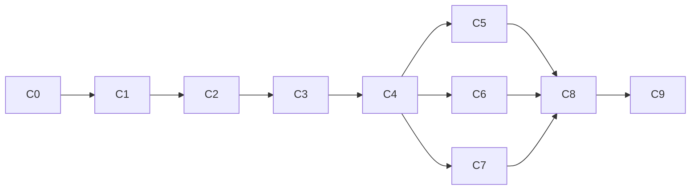

# Master plan

This file is the authoritative current plan. [ADR 0002](adr/0002-TASKMASTER_SCOPE.md) supersedes the Fleet and autonomous-IAM parts of the earlier design without rewriting that history.

## Outcome

By August 31, 2026, demonstrate one real GitHub Actions → Google Cloud WIF cutover with exact-key proof, no added downstream privilege, human separation of duties, eight hostile tests, post-disable continuity, a served ADK/Gemini Taskmaster, and reconstructable evidence.

Current checkpoint on August 25: a second, independent fresh disposable key (`851d4503…`) repeated the entire transaction, deliberately testing the August 24 finding's fix. The fix worked exactly as predicted — gating the hostile jobs behind `KEYLESS_K0_POST_DISABLE_PUSH` correctly skipped h6/h7/h8 on the post-disable push, confirmed live, because this transaction's own `wif-1` deploy pinned bytes that already included the gate from the start. Legacy baseline, ProofV2, the WIF cutover, `wif-1`, and H1–H8 all completed; the canonical pre-disable archive checkpoint was reviewed and merged before the key was disabled, the correct ordering proven a second time. The key was disabled by a human and proven unable to authenticate afterward. The post-disable push then deployed live through WIF with no key involved. But continuity's evidence still could not be certified: isolating the audit window to just the deploy job, with every hostile job skipped or left unapproved, still produced three Cloud Audit Log entries, not the required two — one from the authentication action's own credential-setup exchange, one pair from `gcloud run deploy`'s own independent exchange when it actually calls the Cloud Run API. This is inherent to how this authentication action and `gcloud` combine on any deploy, hostile-free or not; the August 24 trigger-sharing bug was a real, now-fixed problem, but not the only one. See `README.md`'s "The second transaction" section for the complete account with run IDs and timestamps. Overall status remains **NO-GO**: archive-before-disable ordering is proven twice, independently; continuity is not, for a structural reason in the authentication mechanism itself, understood more precisely than before but not yet resolved.

For the 48-hour gate, the verifier selects the earliest authoritative occurrence time, checkpoint-receipt `recorded_at`, or checkpoint event time across the final evidence and requires `manifest.assembled_at`—the latest authenticated final collection—to be no more than 48 hours later. Archive or checkpoint sealing and later recollection cannot reset, backdate, or extend that window. A pull request's `reviewed_at` is one of those authoritative occurrences, so the window opens at the first approval PR review of the transaction, before any workflow has run.

## Fresh v3 execution order

1. Publish the protected RC, repair `required_linear_history: true`, and read the protection back. **Done:** PRs #18/#19 and the 2026-08-15 protection read-back.
2. Under separate authorization, collect a fresh legacy baseline, ProofV2, WIF-1 parity, and H1–H8 including H2 for one new disposable key transaction. **Done:** `legacy-3`, ProofV2 run 32761994628, `wif-3`, all eight hostile denials.
3. Review and merge the canonical pre-disable archive checkpoint while that key is still enabled. **Done:** PR #35, merged and its check/run both completed before disable.
4. Have the human key operator disable the exact fresh key and independently read back key state plus Admin Activity. **Done:** `2026-08-24T20:05:49Z`, principal `yashwanth.surabhi@gmail.com`.
5. Prove fresh legacy denial before deploying and reading back `wif-2`. **Legacy denial done** (run 32771996082). **`wif-2` not achieved** — structurally blocked; see the current-checkpoint paragraph above.
6. Run the authenticated read-only pending issuer and verify its private pending output. **Not attempted** — requires `post_disable` evidence that cannot exist for this transaction.
7. Separately authorize the scoped KMS signature and verify it against pinned out-of-band trust. **Not attempted**, same reason.
8. Leave release to a separate human decision; no local state or signature promotes release readiness. Moot without step 6–7; `release_ready` remains `false`.

A second, independent repeat of this exact order on August 25 (key `851d4503…`, `legacy-4`, `wif-5`/`wif-6`) confirmed step 3's fix for the August 24 finding works, then hit a second, deeper reason step 5's `wif-2` cannot be certified: any clean deploy through this authentication action and `gcloud` combination produces three audit-log entries, not two, independent of hostile-job interference. See README's "The second transaction" section for the full account.

`REVIEWER_RUNBOOK.md` owns the executable form of this order, including which steps need a `production` approval, the three separate release-marker pull requests the `push`/`paths` trigger forces, and the actor/reviewer separation the verifier requires.

## Rules traceability

| Official requirement | Planned artifact | Release evidence |
|---|---|---|
| Gemini 3.5+ | `gemini-3.5-flash` through Vertex AI | Model/version and redacted trace ID |
| Google agent framework | Google ADK Taskmaster | Served Cloud Run path and ADK trace |
| Google Cloud infrastructure | Cloud Run, Firestore, IAM/WIF, KMS | Resource IDs and audit/read-back evidence |
| Complete workflow beyond chat | Evidence → PR → tests → human gates → receipt | GitHub runs, Cloud Run revisions, receipt |
| Repository and reproducibility | Public repo, CI, quickstart, license | Clean clone release check |
| Architecture diagram | README and architecture document | Submission artifact |
| Public video ≤4 minutes | Truthful completed case plus live action | Public video URL |
| New project during event | Commit history and AI-assistance disclosure | Repository history |

Rules are frozen from the official pages on August 12, 2026. Organizer wording contains stale track labels in one judging section; the top-level Taskmaster definition and global 40/30/30 criteria govern this plan.

## Binding build boundary

Build one repository, workflow, key, deployment service account, allowed service, forbidden service, ProofV2 protocol, deterministic compiler, selected-repository draft PR action, human IAM/merge/disable gates, eight hostile tests, ADK/Gemini evidence and recovery, Firestore replay/state, KMS receipt, minimal evidence view, evaluation, and video.

Do not build Fleet products, Agent Engine, Cloud Tasks, Pub/Sub, webhooks, an outbox, two application services, automated IAM mutation, generic YAML support, arbitrary shell execution, multi-tenancy, automatic key enable/delete, a Plan Agent, or 36 live repositories.

## Delivery chunks

| Chunk | Hours | Outcome | Stop condition |
|---|---:|---|---|
| C0 | 2 | First commit/remote, license, disclosure, rules snapshot, Taskmaster ADR | Provenance missing |
| C1 | 4 | Disposable GitHub/GCP substrate and `legacy-1` | Shared/broad identity, missing humans, or leak |
| C2 | 4 | Complete ProofV2 issuance, authoritative verification, atomic replay rejection | Exact key unresolved or replay accepted |
| C3 | 12 | Fresh baseline/ProofV2/WIF-1/H1–H8, merged archive checkpoint, human disable, legacy denial, `wif-2`, pending output | Any ordering gap or K0 false-safe; kill |
| C4 | 5 | Typed contracts, deterministic compiler/refusal gates, exact patch bytes | Hand edit or privilege widening |
| C5 | 8 | Cloud Run ADK/Gemini Taskmaster and ablation | Model decorative, unsafe, or leaks data |
| C6 | 4 | Selected-repository GitHub App opens real draft PR | No visible external agent action |
| C7 | 5 | Local v3 authenticated read-only pending issuer and public verifier complete; publication, live execution, and scoped signature pending | Self-assertion or local signature can authorize release |
| C8 | 4 | Local private-snapshot console complete; repeatable live harness and hosted update pending | UI can synthesize success |
| C9 | 8 | 36-bundle eval, CI, quickstart, claim audit, rehearsals, video | Required artifact or evidence missing |

Total: **56 focused hours**. C0–C3 must finish within 48 wall-clock hours, including human coordination and propagation.

## Critical path

## Human authority

- Independent reviewer: protected PR/environment review.
- IAM operator: applies the exact reviewed provider and service-account binding.
- Key operator: disables the exact key after all pre-disable gates.

The same independent second person may fill all three roles in the disposable demo. Keyless itself holds none of those authorities.

## Definition of done

- Stage One requirements are implemented and deployed, not named in prose.
- One fresh v3 transaction has `legacy-1`, `wif-1`, and `wif-2` independently read back in the required order.
- ProofV2 accepts exactly once and verifies GitHub and Google state.
- H1–H8 run at their intended controls and the forbidden service is unchanged.
- Fresh legacy authentication fails after human disable; fresh WIF succeeds.
- Effective downstream service-account permissions do not change during cutover.
- Gemini/ADK meets the published ablation thresholds with zero false-safe output.
- Credentials never enter model input, logs, artifacts, Firestore, receipt, or repository.
- A third party with authorized access can reconstruct the receipt.
- Clean clone, CI, hosted path, architecture, English documentation, and ≤4-minute video pass release review.

## Pivot rule

Kill or pivot immediately on any K0 failure, missing second human/foreign owner, replay acceptance, hostile success, secret leak, generated patch repair, broad/shared deployment identity, post-disable WIF failure, mocked core evidence, failed Gemini necessity gate, or absence of a real external agent action.

## Document authority

1. This master plan owns current scope and ordering.
2. `DEVELOPMENT_PLAN.md` owns executable chunk acceptance.
3. `EVALUATION.md` owns release gates.
4. `CLAIMS_AND_LIMITATIONS.md` owns public wording.
5. ADRs preserve decisions and history.
6. Any conflicting older document is subordinate.
