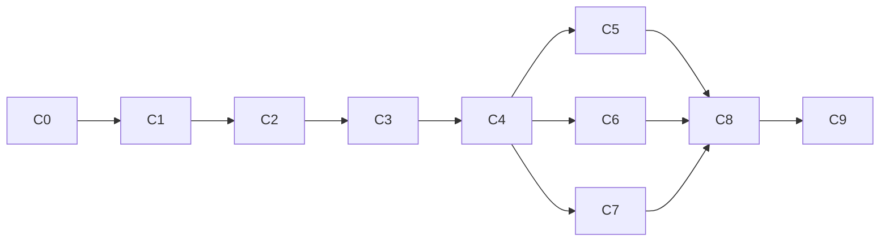

# Master plan

This file is the authoritative current plan. [ADR 0002](adr/0002-TASKMASTER_SCOPE.md) supersedes the Fleet and autonomous-IAM parts of the earlier design without rewriting that history.

## Outcome

By August 31, 2026, demonstrate one real GitHub Actions → Google Cloud WIF cutover with exact-key proof, no added downstream privilege, human separation of duties, eight hostile tests, post-disable continuity, a served ADK/Gemini Taskmaster, and reconstructable evidence.

Current checkpoint on August 13: the live Google/GitHub substrate, legacy deployment, WIF readback, ProofV2 replay rejection, served private ADK/Gemini path, passing sealed agent evaluation, compiler-produced draft PR, and H2 wrong-repository denial exist. Overall status remains **NO-GO** until an independent reviewer approves the protected merge and key action, H1 and the remaining hostile controls run, and post-disable `wif-2` is independently reconstructed.

## Rules traceability

| Official requirement | Planned artifact | Release evidence |
|---|---|---|
| Gemini 3.5+ | `gemini-3.5-flash` through Vertex AI | Model/version and redacted trace ID |
| Google agent framework | Google ADK Taskmaster | Served Cloud Run path and ADK trace |
| Google Cloud infrastructure | Cloud Run, Firestore, IAM/WIF, KMS | Resource IDs and audit/read-back evidence |
| Complete workflow beyond chat | Evidence → PR → tests → human gates → receipt | GitHub runs, Cloud Run revisions, receipt |
| Repository and reproducibility | Public repo, CI, quickstart, license | Clean clone release check |
| Architecture diagram | README and architecture document | Submission artifact |
| Public video ≤4 minutes | Truthful completed case plus live action | Public video URL |
| New project during event | Commit history and AI-assistance disclosure | Repository history |

Rules are frozen from the official pages on August 12, 2026. Organizer wording contains stale track labels in one judging section; the top-level Taskmaster definition and global 40/30/30 criteria govern this plan.

## Binding build boundary

Build one repository, workflow, key, deployment service account, allowed service, forbidden service, ProofV2 protocol, deterministic compiler, selected-repository draft PR action, human IAM/merge/disable gates, eight hostile tests, ADK/Gemini evidence and recovery, Firestore replay/state, KMS receipt, minimal evidence view, evaluation, and video.

Do not build Fleet products, Agent Engine, Cloud Tasks, Pub/Sub, webhooks, an outbox, two application services, automated IAM mutation, generic YAML support, arbitrary shell execution, multi-tenancy, automatic key enable/delete, a Plan Agent, or 36 live repositories.

## Delivery chunks

| Chunk | Hours | Outcome | Stop condition |
|---|---:|---|---|
| C0 | 2 | First commit/remote, license, disclosure, rules snapshot, Taskmaster ADR | Provenance missing |
| C1 | 4 | Disposable GitHub/GCP substrate and `legacy-1` | Shared/broad identity, missing humans, or leak |
| C2 | 4 | Complete ProofV2 issuance, authoritative verification, atomic replay rejection | Exact key unresolved or replay accepted |
| C3 | 12 | Human WIF/IAM, `wif-1`, H1–H8, disable, fresh legacy failure, `wif-2`, manifest | Any K0 false-safe; kill |
| C4 | 5 | Typed contracts, deterministic compiler/refusal gates, exact patch bytes | Hand edit or privilege widening |
| C5 | 8 | Cloud Run ADK/Gemini Taskmaster and ablation | Model decorative, unsafe, or leaks data |
| C6 | 4 | Selected-repository GitHub App opens real draft PR | No visible external agent action |
| C7 | 5 | Firestore operation view and KMS receipt/verifier | Self-assertion can complete receipt |
| C8 | 4 | Repeatable live harness and evidence-derived console | UI can synthesize success |
| C9 | 8 | 36-bundle eval, CI, quickstart, claim audit, rehearsals, video | Required artifact or evidence missing |

Total: **56 focused hours**. C0–C3 must finish within 48 wall-clock hours, including human coordination and propagation.

## Critical path

## Human authority

- Independent reviewer: protected PR/environment review.
- IAM operator: applies the exact reviewed provider and service-account binding.
- Key operator: disables the exact key after all pre-disable gates.

The same independent second person may fill all three roles in the disposable demo. Keyless itself holds none of those authorities.

## Definition of done

- Stage One requirements are implemented and deployed, not named in prose.
- `legacy-1`, `wif-1`, and `wif-2` are independently read back.
- ProofV2 accepts exactly once and verifies GitHub and Google state.
- H1–H8 run at their intended controls and the forbidden service is unchanged.
- Fresh legacy authentication fails after human disable; fresh WIF succeeds.
- Effective downstream service-account permissions do not change during cutover.
- Gemini/ADK meets the published ablation thresholds with zero false-safe output.
- Credentials never enter model input, logs, artifacts, Firestore, receipt, or repository.
- A third party with authorized access can reconstruct the receipt.
- Clean clone, CI, hosted path, architecture, English documentation, and ≤4-minute video pass release review.

## Pivot rule

Kill or pivot immediately on any K0 failure, missing second human/foreign owner, replay acceptance, hostile success, secret leak, generated patch repair, broad/shared deployment identity, post-disable WIF failure, mocked core evidence, failed Gemini necessity gate, or absence of a real external agent action.

## Document authority

1. This master plan owns current scope and ordering.
2. `DEVELOPMENT_PLAN.md` owns executable chunk acceptance.
3. `EVALUATION.md` owns release gates.
4. `CLAIMS_AND_LIMITATIONS.md` owns public wording.
5. ADRs preserve decisions and history.
6. Any conflicting older document is subordinate.
